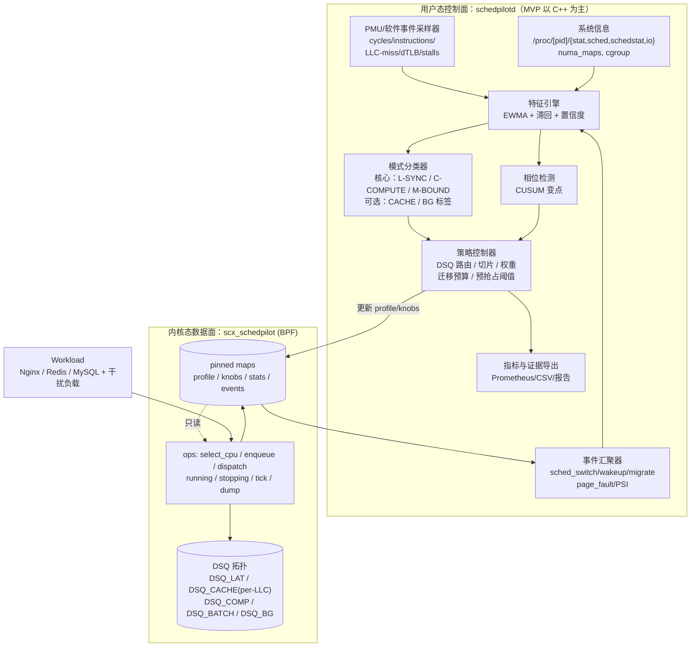

# SchedPilot 设计方案

> 面向云原生高性能负载的 eBPF/sched_ext 用户态自适应调度系统
> 对应赛题：华为命题 ——《基于 BPF/sched_ext 的用户态高性能动态调度器》（国产操作系统软件组）
> 命题企业：华为技术有限公司
> 主开发与性能测试环境：openEuler 24.03 LTS SP4（冻结）；SP1/SP3 仅作有时间时的兼容验证
> 状态：v0.3 省赛 MVP 收敛版（实现落地中，代码位于本目录同一仓库）
> 创建日期：2026-09-29

---

## v0.3 省赛 MVP 收敛说明（2026-09-29）

本节记录省赛阶段的收敛决策，v0.1/v0.2 的长期设想仍然有效，但以下口径优先：

1. **最高优先级**：尽快形成“可运行、可测量、可归因、可演示”的 sched_ext 自适应调度闭环；其余功能不得阻塞该闭环。
2. **核心主线（唯一）**：用户态 PMU + eBPF 调度事件感知 CPU/内存访问模式 → EWMA + hysteresis 三分类（L-SYNC / C-COMPUTE / M-BOUND，BG 仅显式配置标记）→ LAT / COMP / CACHE 三条 DSQ → 用户态慢控制回路自适应策略。
3. **主环境冻结为 openEuler 24.03 LTS SP4**；SP1/SP3 只在时间允许时做兼容验证，不再并列为“主目标”。
4. **Baseline 统一口径**：**openEuler 默认 fair-class 调度器（赛题表述为默认 CFS）**。不把 Linux 6.6 fair-class 的内部实现等同于 mainline 经典 CFS；所有性能结论以同机同内核实测的 A 臂为基准。
5. **PMU multiplex 必须正确处理**：MVP 稳定采集 cycles / instructions / cache-references / cache-misses，并使用 `time_enabled/time_running` scaling 计算 IPC、MPKI；PMU 不可用时必须记录原因并走降级路径（禁止冒充 PMU 结果）。
6. **推进方式**：最小调度器 → 立即 benchmark → profiling → 一次只增加一个机制 → 再 benchmark → 只保留有稳定收益的机制；尽快拿到第一组 default fair vs SchedPilot 的 Redis 曲线。
7. **省赛不做（P1/P2/Future）**：CUSUM 相位检测、贝叶斯/爬山自动调参、producer-consumer 自动识别、精确 NUMA remote/local 比例、动态 BG CPU pool、RAPL、RPC、Kubernetes、多负载全面适配（见 `docs/00_mvp_scope.md`）。
8. **NUMA 表述约束**：如实现 NUMA 相关能力，只允许表述为“基于当前 CPU NUMA node 与 /proc/[pid]/numa_maps 页面分布推断的 CPU–memory placement locality/mismatch”，不宣称直接得到精确 local/remote memory access ratio。
9. **实验要求（省赛）**：A=默认 fair → B=基础 sched_ext → C=+任务分类 → D=SchedPilot full adaptive 递进对照 + 关键机制消融；旗舰场景只聚焦 Redis + CPU/内存后台干扰混部；客户端隔离必须显式；核心结果 ≥20 次有效交织重复；保存全部原始 CSV/JSON、运行配置、git commit、系统信息、调度器状态、PMU 原始计数与日志；统计 QPS、p50/p95/p99/p99.9、CPU 利用率、上下文切换、迁移次数、IPC、MPKI、scheduler/daemon overhead，并报告中位数、IQR、均值/标准差与 95% CI。
10. **验收目标**：真实 ACTIVE sched_ext policy 下，相比同环境 default fair baseline，Redis 混部场景 P99 降低 ≥10% 或固定 P99 SLO 下有效吞吐提高 ≥10%，并可通过 map、DSQ dispatch、分类事件、策略更新日志、原始实验数据与消融结果证明改进来自 SchedPilot；无干扰场景尽量控制在 ±2% 以内且不得明显退化。
11. **已落地实现（v0.3.0-mvp）**：`bpf/scx_schedpilot.bpf.c`、`loader/scx_schedpilot.c`、`daemon/schedpilotd`、`scripts/env_check.sh`、`scripts/build.sh`、`scripts/schedpilotctl.sh`、`bench/*` 与 `docs/*` 已提交；在开发机 rd350x（Ubuntu 24.04 / clang 18 / libbpf 1.3）完成全量编译与脚本检查，证据见 `evidence/rd350x-dev-20260929/`。
12. **当前阻塞项（真实记录）**：SP4 主环境（192.168.1.123）在开发期间处于离线状态，sched_ext 加载、Redis 实测与 20 次重复实验尚未执行；恢复后按 `docs/02_test_plan.md` 一键执行，未完成前不产出任何性能结论。


---

## 0. 项目申请信息与方案对齐

本方案以项目申请/计划材料中的目标、阶段出口和交付口径为约束，进一步补充实现边界、技术路线与可复现实验方法。当前文档中尚未取得正式报名表的参赛学校、负责人、指导教师和最终提交日期，因此不在此处虚构，正式提交版封面按报名信息补齐。

| 项目字段 | 当前确定内容 |
|---|---|
| 项目名称 | SchedPilot：基于 BPF/sched_ext 的用户态高性能动态调度器 |
| 命题企业 | 华为技术有限公司 |
| 命题组别 | 国产操作系统软件组 |
| 目标系统 | openEuler 24.03 LTS SP4（主环境，冻结）；SP1/SP3 作兼容验证 |
| 首个核心验证场景 | Redis 延迟敏感服务与 CPU/内存密集型后台任务混部 |
| 扩展场景 | Nginx、MySQL、RPC 及计算密集型任务；容器/Kubernetes 作为后续工程化验证 |
| 核心性能目标 | 相同硬件、内核、负载和资源约束下，相比系统默认 fair 调度器，首验 Redis 场景吞吐提升或 P99 延迟降低不低于 10% |
| 可靠性口径 | 支持能力探测、加载/卸载、watchdog、异常回退和可复现实验；其他约定场景不得出现明显性能回退 |
| 交付形式 | 用户态控制程序、eBPF/sched_ext 调度器、安装与回滚脚本、测试/原始数据/报告及可审查代码 |

### 0.1 申请书主张在本方案中的落点

1. **真正使用 BPF/sched_ext**：SchedPilot 的主执行路径是 `SCX_OPS` 调度器，用户态负责特征分析和策略决策，BPF 负责调度快速路径；不把 cgroup、nice 或静态 CPU 配额包装成调度器。
2. **感知 CPU/内存访问模式**：MVP 使用两类可解释特征——(a) 调度事件（wakeup 频率、平均运行时长、平均 run delay）；(b) 硬件 PMU（IPC、LLC MPKI，带 multiplex scaling）。NUMA 仅作为可选增强，且表述限定为“基于 NUMA node 与 /proc/[pid]/numa_maps 页面分布的 placement locality/mismatch 推断”。
3. **先做可归因的 Redis 闭环**：先固定裸机/进程或 cgroup 的 Redis 混部 workload，完成 default fair → 基础 sched_ext → 分类调度 → full adaptive 的递进对照，再扩展 Nginx、MySQL 和 Kubernetes。
4. **10% 是正式验收目标**：当前没有把目标性能写成已取得的结果；所有正式结论必须来自固定环境、重复实验、原始数据、配置和 commit 可追溯的证据包。
5. **申请材料中的阶段出口**：报名与校赛阶段完成可演示 MVP；省赛强化阶段完成感知、DSQ、反馈与 Redis 性能验收；总决赛阶段完成多负载、运维回滚、文档和发布候选版本。

## 1. 赛题解读

### 1.1 题目要求拆解

| 赛题要求 | 解读 | 量化目标 |
|---|---|---|
| 基于 BPF/sched_ext 实现用户态调度器 | 必须是真正的 sched_ext 调度类（`SCX_OPS`），不是 cgroup/nice 的包装；用户态负责策略决策，BPF 负责快速路径 | 可在 openEuler 上加载/卸载，回退默认 fair 调度器无宕机 |
| 调度策略感知 CPU/内存访问模式并动态调整 | 不能只用唤醒频率/优先级等启发式；要直接或间接观测计算密集度与缓存行为 | 至少 2 类可解释的 CPU/内存特征参与调度决策 |
| Nginx / Redis / MySQL 典型负载下较默认 fair 调度器（赛题表述为默认 CFS）提升 ≥10% | 以吞吐量提升或延迟降低二者之一达成即可；旗舰场景为 Redis + 干扰混部 | 旗舰场景 ≥10%，其余场景无显著劣化 |
| 完整测试方案和性能对比数据 | 可复现的实验矩阵 + 原始数据 + 统计方法 | 一套命令复现全部结论 |

### 1.2 评分点映射（总分构成）

| 评分项 | 权重 | SchedPilot 对应策略 |
|---|---|---|
| 功能完整性 | 35% | sched_ext 完整调度器 + 用户态控制面 + 多类 DSQ + 感知闭环 + 动态调整 + 安全回退 + Redis 首验/多场景扩展 |
| 性能提升幅度 | 30% | 首验 Redis 混部场景相对默认 fair 达到吞吐或 P99 不低于 10% 的改善，含消融与可复核统计 |
| 创新性和代码质量 | 25% | PMU 内存访问模式感知、缓存感知放置与迁移预算、相位感知自适应、双回路控制；CI/测试/文档规范 |
| 文档完整性 | 10% | 设计文档、用户手册、测试报告、实验数据包、演示材料 |

### 1.3 关键边界（必须写进文档，避免评审误解）

- sched_ext 只接管 `SCHED_NORMAL` / `SCHED_BATCH` / `SCHED_IDLE`，RT/DL 任务不受影响（因此调度器不承诺对实时任务的效果）。
- openEuler 24.03 LTS 系列属于 6.6 基线内核对 sched_ext 的回移（backport），API 与 6.12 上游可能有差异；**必须锁定内核版本 × scx 版本对**。主验证固定为 SP4；SP1/SP3 只在时间允许时做兼容验证。
- 不能预先假设所有 openEuler 发行内核都启用了 `CONFIG_SCHED_CLASS_EXT`，或都与上游 6.12 API 完全一致。需要在 Day-0 做能力探测（`scripts/env_check.sh`），锁定 kernel × scx 版本对，并准备自编译内核兜底路径；EulerPilot 中已有的能力探测和构建脚本可作为工程起点。
- Baseline 术语：统一写作“openEuler 默认 fair-class 调度器（赛题表述为默认 CFS）”。Linux 6.6 的 fair-class 实现不等同于 mainline 经典 CFS，文档与实验不得在未验证的情况下混用这两个概念。

---

## 2. EulerPilot 项目基础与 SchedPilot 继承关系

EulerPilot 是"观测-决策-执行-反馈-证据"的资源管控 Agent，调度只是其中一个 Skill；SchedPilot 是它的**调度专项衍生项目**：砍掉 Network/Security 等横向能力，把 sched_ext 从"增强路径"提升为"主执行路径"，并新增硬件计数器驱动的 CPU/内存访问模式感知。

### 2.1 差异定位

| 维度 | EulerPilot | SchedPilot |
|---|---|---|
| 目标 | 通用资源管控 Agent | 单点极致的自适应调度器 |
| 主执行路径 | cgroup v2（SP3 稳定）+ scx（增强） | sched_ext 调度器本身 |
| 感知 | eBPF 调度事件 + PSI | eBPF + PSI + **PMU/NUMA 内存访问特征** |
| 策略 | Skill 编排 + PsiGate 状态机 | 分类器 + 双回路自适应控制 |
| 场景 | 通用 | Nginx / Redis / MySQL 精调 |

### 2.2 可直接复用清单

EulerPilot 是本项目的重要工程基础，公开仓库为 <https://github.com/shibuchou/EulerPilot>。以下路径均以 EulerPilot 仓库根目录为基准；本地克隆仅用于开发验证，不作为 SchedPilot 的运行时依赖。

| 资产 | 位置 | 复用方式 |
|---|---|---|
| scx 原型（4 DSQ + class_map + gate） | `sched/scx_eulerpilot.bpf.c`、`sched/scx_eulerpilot.c` | 直接演进为 `scx_schedpilot`，保留类映射/统计/pin 命名空间思路 |
| 调度观测 eBPF | `bpf/workload_observer.bpf.c` | sched_wakeup/switch/migrate 事件采集 |
| PSI 门控 | `agent/include/psi_gate.hpp`、`agent/observer/psi_reader.*` | 控制回路使能/降级条件 |
| 能力探测 | `agent/src/capability_detector.cpp` | 扩展 sched_ext/BTF/PMU 探测 |
| 构建与统计脚本 | `scripts/build_scx_eulerpilot.sh`、`collect_scx_stats.py` | 编译、pin 校验、统计导出 |
| 基准与图表工具 | `bench/nginx_compare_summary.py`、`redis_compare_summary.py`、`extract_wrk_metrics.py`、`render_*` | 实验流水线直接扩展 MySQL/干扰场景 |
| 证据与质量门 | `bench/formal_artifact_gate.py`、`write_run_manifest.py`、`final_quality_gate.sh` | 复刻"可审计证据包"方法论 |
| 工程规范 | `docs/`、`reports/`、`evidence/` 目录习惯 | 文档与提交材料骨架 |

> 注意：不搬运 EulerPilot 的 Network/Security 代码；只保留观测、证据、构建、基准四类基础设施。

### 2.3 已有工程基础与可验证证据

本节区分“已经存在、可以复用的工程资产”和“需要在 SchedPilot 中重新实现并验收的目标”，避免把 EulerPilot 的能力直接等同于 SchedPilot 已经完成。

| 申请能力对应项 | EulerPilot 中可核验的基础 | SchedPilot 的使用边界 |
|---|---|---|
| sched_ext 加载与调度闭环 | `sched/scx_eulerpilot.c`、`sched/scx_eulerpilot.bpf.c`，已有用户态 loader、DSQ、class map、stats 和 gate 状态 | 演进为 `scx_schedpilot`；PMU 分类、拓扑 DSQ 和动态策略仍需新实现与回归 |
| eBPF 任务观测 | `bpf/workload_observer.bpf.c`，已有 task metrics、调度事件和生命周期处理思路 | 复用事件模型，补充与 sched_ext 任务画像、LLC/NUMA 特征的关联 |
| 平台能力与压力门控 | `agent/src/capability_detector.cpp`、`agent/src/psi_gate.cpp` | 扩展 openEuler kernel/BTF/sched_ext/PMU 探测，并把不可用特征标记为 `unavailable` |
| 构建、状态和统计 | `scripts/build_scx_eulerpilot.sh`、`scripts/collect_scx_stats.py` | 改造成目标内核版本可记录、可回滚、可导出证据的 SchedPilot 流程 |
| 性能数据与质量门 | `bench/`、`scripts/formal_artifact_gate.py`、`write_run_manifest.py`、`final_quality_gate.sh` | 复用 evidence archive 思路，新增 Redis 首验及 Nginx/MySQL workload adapter |

目前能够确认的是“具备可复用的 eBPF/sched_ext 原型和实验工程基础”；SchedPilot 的 ACTIVE adaptive policy、CPU/内存模式分类和 10% 性能目标仍属于本项目待完成、待测量的内容。

---

## 3. GitHub 相关项目调研

以下项目用于借鉴接口组织、DSQ 设计、控制回路和工程化经验，不作为 SchedPilot 的运行时依赖，也不把外部项目的性能结果直接当作本项目结果。

### 3.1 官方生态：sched-ext/scx

- 仓库：<https://github.com/sched-ext/scx>；官方调度器（Rust）列表见 `scheds/rust/README.md`：
  `scx_bpfland`、`scx_rustland`、`scx_lavd`、`scx_layered`、`scx_rusty`、`scx_flash`、`scx_cosmos`、`scx_tickless`、`scx_p2dq`、`scx_eevdf`、`scx_chaos`、`scx_mitosis`、`scx_beerland`、`scx_cake`、`scx_forge`、`scx_pandemonium` 等。
- 重点关注官方 examples、`scheds/rust/` 与 C 示例的当前接口写法；具体 API 以目标 openEuler 内核和配套 `tools/sched_ext` 版本为准。
- 构建时锁定 clang、libbpf、bpftool、内核头文件和 scx 版本，不把某个上游版本的目录结构或 API 默认映射到 openEuler backport。

### 3.2 最值得借鉴的三个项目

| 项目 | 简介 | 对 SchedPilot 的启发 |
|---|---|---|
| **scx_layered**（Meta 案例研究 <https://github.com/sched-ext/scx/blob/case-studies/case-studies/scx_layered.md） | 按 cgroup/特征分层，将低优先级工作负载"收容"到高利用率 CPU 池（动态调整 CPU 数），主负载负 nice 线程抢占；生产 ~1000 台机器，配合调度器迭代整体 >5% 吞吐收益 | 分层/收容思想、软亲和、用户态配置驱动策略；也证明了"低优先级工作不要四处污染缓存"的收益路径 |
| **PANDEMONIUM**（<https://github.com/wllclngn/PANDEMONIUM>，已进入 sched-ext/scx） | Rust+C23 实现；**无任务分类器**，全部基于纳秒级"应得服务量"（CoDel sojourn）、R_eff 拓扑电阻亲和、迁移势 Φ 定价、阻尼谐振 stall 检测、1Hz 混沌特征自适应回路；p99 唤醒延迟比 EEVDF 改善数倍 | 双回路结构（BPF 数据面 + 用户态控制面）、拓扑/缓存感知放置、迁移代价定价、安全护栏（starvation rescue、watchdog、NO_HZ_FULL 免疫）；是"硬核自适应"的参照系 |
| **Gthulhu**（<https://github.com/Gthulhu/Gthulhu>，CNCF eBPF Landscape） | 云原生运行时调度平台：K8s 分配意图（Pod→cgroup→TGID/TID）下发到每节点 Decision Maker，再落到 sched_ext；TID 感知 worker 线程策略 | **TID 粒度**策略（线程而非进程才是调度实体）、意图/数据分离架构、可观测性指标（run delay、迁移次数、调度压力）；适合借鉴其"策略描述与执行分离" |

### 3.3 其他相关

- `scx_horoscope`：娱乐/教学型调度器（说明 sched_ext 的易用性）。
- Gthulhu/qumun：Go 编写自定义 sched_ext 调度器的框架。
- CachyOS 内核、linux-tkg：发行版层 sched_ext 启用与打包参考。
- 文献入口：LWN《The extensible scheduler class》<https://lwn.net/Articles/922405/>；内核文档 `Documentation/scheduler/sched-ext.rst`；LPC 2024/2025 sched_ext MC。

### 3.4 差距分析与本项目切入点

1. 本项目不以“重新实现一个通用调度器”为目标，而是围绕赛题要求，把 PMU/软件事件、NUMA 局部性和 eBPF 调度事件组织成可解释的任务画像。
2. `scx_layered` 的分层/收容思想可用于后台干扰隔离；SchedPilot 进一步验证同一节点中 Redis 服务线程与 CPU/内存密集型任务混部时，任务画像、LLC/NUMA 亲和和迁移预算是否带来可归因收益。
3. 外部项目的场景、内核版本和硬件条件各不相同，不能直接引用其收益作为 SchedPilot 的性能证明；本项目必须建立自己的 default fair、基础 sched_ext、分类调度和 full adaptive 对照链路。
4. 差异化假设是：在 Redis 首验场景中，CPU/内存访问特征与服务 SLO 联合反馈，比单纯静态优先级或固定分层更可能在干扰共存时保护 P99 或有效吞吐；该假设必须通过消融实验验证。

---

## 4. 总体设计

### 4.1 一句话定位

**SchedPilot 用硬件计数器和软件事件"看见"任务的 CPU/内存访问模式，用 sched_ext 在纳秒级执行分类结果，用用户态控制回路在百毫秒级持续校准策略，先在 Redis 与 CPU/内存干扰混部场景中争取相对默认 fair 的吞吐或 P99 改善不低于 10%，再扩展到 Nginx/MySQL。**

### 4.2 架构图



### 4.3 控制回路（双回路）

```
快速回路（BPF，ns~μs）：分类查询 → DSQ 选择 → 切片/预抢占 → 直接本地派发
慢速回路（用户态，100ms）：PMU 差分 → 特征更新 → 分类/相位 → 写 knob map
聚合回路（用户态，1s）  ：统计快照 → 指标导出/告警 → 证据落盘
```

- BPF 侧只做 O(1) 查表，不做浮点/复杂计算（verifier 约束）。
- 用户态故障时：BPF 自动退化为内置安全静态策略（或整体 detach 回 CFS），保证 fail-open。
- 每个 knob 均可配置上下界，策略写入前做 schema 校验，失败回滚上一版。

### 4.4 DSQ 拓扑设计

| DSQ | 用途 | 排序 | 切片 | 说明 |
|---|---|---|---|---|
| `SCX_DSQ_LOCAL` | 唤醒即空闲 CPU 直投 | FIFO | 默认 | 最快路径，零排队 |
| `DSQ_LAT` | 延迟敏感同步任务（Redis 主循环、Nginx worker 等） | FIFO/最短等待优先 | 短（~0.5–1ms） | 可抢占其它 DSQ 的居民 |
| `DSQ_CACHE`（每 LLC 一个） | 缓存友好任务（M-BOUND） | vtime | 长（~2–6ms） | 软亲和到 LLC 域，降低迁移 |
| `DSQ_COMP` | 计算密集（C-COMPUTE） | vtime | 中（~1–4ms） | 公平份额，弱亲和 |
| `DSQ_BATCH` | 吞吐型批处理 | vtime | 长（~6–20ms） | 可被 LAT 抢占 |
| `DSQ_BG` | 后台干扰（备份、监控、爬虫） | vtime | 长且受限 | 软收容到指定 CPU 范围（借鉴 scx_layered Confined） |

- 类映射键：`TGID`（缺省）→ 支持 `TID` 覆盖（借鉴 Gthulhu：真正被调度的是线程，LLM/DB worker 通常是非 leader 线程）。
- 生命周期：任务退出/exec 时清理 map（EulerPilot 原型用 hash；生产版需处理 PID wrap，可用 `task_storage`/`fentry` 或 LRU + `ops.enable/disable` 兜底）。
- 饥饿保护：所有 DSQ 在任何状态下都必须被 dispatch 消费（沿用原型的"stale classified tasks"思路），加 starvation rescue 时间下限。

---

## 5. 关键机制设计

### 5.1 CPU/内存访问模式感知（核心创新，直接对应赛题要求 2）

| 维度 | 信号 | 采集通道 | 判定用途 |
|---|---|---|---|
| CPU 模式 | IPC = instructions/cycles；stalled-cycles-backend | 用户态 PMU group（按白名单任务读取） | 区分计算密集 vs 内存等待 |
| 内存模式 | LLC-load-misses/KI（MPKI）、cache-misses/references | 用户态 PMU group；不可用时软件事件降级 | 内存受限判定、迁移代价输入 |
| TLB 行为 | dTLB-load-misses/KI | PMU group | 大页/随机访存特征 |
| NUMA 局部性（P1，可选） | CPU–memory placement locality/mismatch 推断 | 当前 CPU NUMA node + `/proc/[pid]/numa_maps` 页面分布 | 放置决策参考；表述不得超出推断口径 |
| 页行为 | 次缺页/主缺页速率、`kmem:mm_page_alloc`、`vmscan` 压力 | BPF tracepoint | 内存压力相位、访问局部性变化（P1） |
| IO/睡眠模式 | IO 等待占比、自愿切换率、睡眠时长分布 | BPF `sched_switch`/`sched_wakeup` | L-SYNC（同步等待）vs T-BATCH |
| 唤醒行为 | 唤醒频率、运行时长分布、run delay | BPF 观测（复用 EulerPilot） | 同步/交互型判定 |
| 迁移敏感性 | 迁移前后 LLC miss 增量 | PMU 差分 + `sched_migrate_task` | 迁移预算模型 |

**为什么用 PMU 而不是只用启发式**：赛题明确要求"感知 CPU/内存访问模式"。唤醒频率只能推断"像不像交互型"，无法区分"计算密集"与"内存带宽受限"。用 IPC + MPKI 可以直接给任务打上"计算/内存"标签，并量化迁移的缓存代价。

**降级策略（重要工程约束）**：

- PMU 不可用（虚拟机、`perf_event_paranoid` 限制、VM 无 vPMU）→ 自动降级：软件事件（cpu-clock、task-clock）+ 缺页统计 + `/proc` 特征 + PSI，分类器置信度降低但仍可工作；
- PMU 可用但采样开销需评估：用户态按任务或进程组读取非采样计数，每 100ms 做一次差分；MVP 阶段只监控白名单 TGID（首验优先 Redis 及干扰任务），避免全系统采样。BPF 负责调度事件和执行策略，不假设在 verifier 受限路径中直接完成复杂 PMU 计算。

### 5.2 模式分类器（软标签 + 滞回）

- 输入特征做 EWMA + 滞回（MVP：alpha=0.3，连续 5 个周期确认切换），MVP 只承诺三类核心标签：
  - **L-SYNC**：高频唤醒、短运行、低 run delay；
  - **C-COMPUTE**：高 IPC、低 LLC MPKI；
  - **M-BOUND**：低 IPC 或高 LLC MPKI（路由到 CACHE DSQ）；
- BG 由 cgroup/进程名单显式标记，MVP 不做自动 BG 分类；`T-BATCH` 作为后续调度动作/队列属性，而不是必须独立识别的任务类别。
- 滞回与去抖：类切换需连续 N 个周期（如 5×100ms）满足阈值，避免抖动（参考 EulerPilot PsiGate 的 NORMAL→ARMED→ACTIVE→COOLDOWN 思路）。
- 相位检测（P1，非省赛阻塞项）：对关键序列（MPKI、唤醒频率、run delay）做 CUSUM 变点检测，识别 MySQL checkpoint/扫描、Redis RDB fork 等相位，相位变化时触发策略瞬态。
- 可解释性：每次分类结果、特征值、置信度与判定原因持续写入 JSONL 可审查日志（MVP 实现），并保留 ringbuf 扩展位。

### 5.3 放置与迁移策略（CPU/缓存/内存视角）

1. **唤醒链同域共置（P1）**：识别生产者-消费者对（如 Nginx worker ↔ 网卡软中断、Redis 主线程 ↔ IO 线程），同 LLC 优先放置（借鉴 PANDEMONIUM 的 pair/亲和思想）。省赛 MVP 不实现复杂自动识别。
2. **LLC 软亲和 + 迁移惩罚（MVP 已实现）**：M-BOUND 任务按 waker 所在 LLC 域路由到对应 CACHE DSQ；跨域迁移在 vtime 上施加可调惩罚（`migrate_penalty_ns`），减少无意义迁移。
3. **NUMA（P1，可选）**：只允许实现“基于当前 CPU NUMA node 与 /proc/[pid]/numa_maps 页面分布的 placement locality/mismatch 推断”，不宣称直接获得精确 local/remote memory access ratio。
4. **干扰收容（MVP：vtime 降权；CPU pool 为 P1）**：BG 类任务通过显式配置标记，MVP 用低权重 + 长切片 + 不抢占实现软收容；动态 CPU pool 列为 P1，不阻塞省赛。
5. **预抢占（MVP 已实现）**：L-SYNC 唤醒且目标 CPU 非空闲时，按速率限制触发 `SCX_KICK_PREEMPT`；阈值由 cfg 下发并可消融。

### 5.4 自适应控制回路（用户态）

| Knob | 默认 | 输入信号 | 调整方向（MVP 实规则，全部有界） |
|---|---|---|---|
| `lat_slice_ns` | 1ms | L-SYNC 平均 run delay | 延迟升高→步进缩短（下限 0.3ms，上限 1.5ms） |
| `cache_slice_ns` | 8ms | M-BOUND 的 LLC MPKI | MPKI 高→增大切片（2–16ms 界内） |
| `migrate_penalty_ns` | 2ms | CACHE 任务实际迁移频率 | 迁移多→增大惩罚（1–8ms 界内） |
| `comp_slice_ns` | 4ms | 公平性/吞吐 | MVP 保持静态可配，P1 再做自适应 |
| `bg_vtime_pct` | 200 | BG 收容开关（消融项） | 100 = 不惩罚；配合 `SP_FLAG_BG_CONTAIN` |
| `preempt_thresh_ns` | 0.5ms | LAT 唤醒预抢占速率限制 | 可消融（`SP_FLAG_PREEMPT`） |
| heartbeat / watchdog | 2s | daemon 心跳 | 超时→BPF 使用静态安全参数（fail-open） |

- 调参策略：MVP 用规则+边界+每 tick 只改一个 knob；爬山/贝叶斯优化为 P2，不进入省赛。
- 全部 knob 有硬性上下界与失效保护；写入带 generation 号，BPF 侧按 mode/心跳校验后生效。

### 5.5 安全性与可靠性（fail-open）

| 风险 | 对策 |
|---|---|
| BPF 调度器挂死/饥饿 | `SCX_OPS` 内置 watchdog 超时自动 abort 回默认 fair 调度器；starvation rescue 下限；tick 轮转扫描 |
| 用户态 daemon 崩溃 | 心跳检测；策略停止更新则 BPF 保持最后一版安全参数（带过期降级）；可配置直接 detach |
| 恶意/异常负载 | 类映射白名单 + 目标限定（cgroup/PID/TID），非目标任务走安全共享 DSQ（vtime 公平） |
| verifier/编译兼容 | 锁定 clang/libbpf/kernel 版本；CI 中做多版本矩阵编译 |
| 误配置 | 配置 schema 校验、observe-only 干跑模式、附回滚脚本 |
| PID wrap/任务生命周期 | per-task map 清理策略（enable/disable + LRU + 定期 GC），并有压力测试覆盖 |

---

## 6. 场景策略设计

申请书确定的验证顺序是“Redis 首验、Nginx/MySQL 扩展”。因此性能投入和正式验收优先集中在 Redis 混部闭环，扩展场景用于证明策略的可迁移性和回归边界，不把三个场景都承诺为第一阶段同时完成。

### 6.1 Redis（首验场景：内存数据库，低延迟）

- 目标：GET/SET p99 与吞吐（干扰场景）改善。
- 关键机制：主线程严格 L-SYNC（短切片、可抢占、避免迁移）；RDB/AOF fork 子进程标记为 T-BATCH（长切片但不抢主线程）；网络 IO 与主线程同 LLC。
- 实验干扰：内存带宽压力（`stress-ng --stream`）与 CPU 抢占用例分开测。

### 6.2 Nginx（扩展场景：Web 服务器，延迟 + 吞吐）

- 目标：keep-alive 长连接下 p99 请求延迟降低；干扰共存时不劣化。
- 关键机制：worker ↔ 软中断同 LLC；BG 收容；L-SYNC 预抢占；连接风暴时对 accept 线程短切片高权重。
- 实验干扰：`stress-ng --cpu N --vm` 或独立 cgroup 中的编译任务。

### 6.3 MySQL（扩展场景：数据库，吞吐 + 尾延迟）

- 目标：OLTP 读为主场景 TPS 提升或 p99 降低。
- 关键机制：查询线程按 IPC/MPKI 动态分 C-COMPUTE / M-BOUND；M-BOUND 扫描线程长切片、低迁移；日志/IO 线程 L-SYNC；相位检测应对 checkpoint/刷脏；buffer pool 命中率低的任务降低跨核迁移。
- 实验干扰：同机 sysbench 双实例竞争、备份任务（BG）。

### 6.4 场景假设（待实验验证）

| 编号 | 假设 | 判定指标 |
|---|---|---|
| H1（核心） | 干扰共存下，Redis p99 延迟降低 ≥10%，或在固定 P99 SLO 下有效吞吐提升 ≥10% | `memtier_benchmark`/`redis-benchmark` p99、QPS |
| H2（扩展） | 干扰共存下，Nginx 吞吐提升 ≥10%，或 p99 降低 ≥10% | `wrk`/`wrk2` RPS、延迟 |
| H3（扩展） | 干扰共存下，MySQL OLTP read-only TPS 提升 ≥10%，或 p99 降低 ≥10% | `sysbench` TPS、延迟 |
| H4 | 无干扰纯场景相对默认 fair baseline 不劣化（±2% 内） | 三场景吞吐/延迟 |

---

## 7. 测试与实验方案

### 7.1 环境

- 系统：**openEuler 24.03 LTS SP4（主环境，冻结）**；SP1/SP3 仅作有时间时的兼容验证。
- 内核：优先使用发行版已启用 sched_ext 的内核；若能力探测失败，使用自编译内核（`CONFIG_SCHED_CLASS_EXT=y`，EulerPilot 已有该路径的构建经验），并记录内核 commit、config 和 backport 差异。
- 硬件：优先裸机（PMU 可用），≥8 核；固定 governor=performance，记录 THP/超线程/NUMA 设置。
- 工具链：clang、libbpf、bpftool 及目标内核配套头文件全部随实验清单锁定；控制面采用 C++（libbpf），复用 EulerPilot 的能力探测、PSI 与证据设施，但**不把 EulerPilot 已有能力表述为 SchedPilot 的已完成能力**。

### 7.1.1 客户端隔离（单机测试强制）

优先使用独立客户端机器发压。若只能单机测试：

- `redis-benchmark` 必须固定到独立 CPU 集合（与 Redis、干扰任务的 cpuset 不相交），例如 `taskset -c 4-7`；
- 客户端进程必须通过 `configs/*.conf` 的 `exclude_names` 明确排除出 SchedPilot 分类与调度目标；
- 实验中记录客户端 CPU 集合与排除名单，任何客户端调度变化不得进入结论解释。

### 7.1.2 PMU 采样与 multiplex scaling（MVP 必须实现）

- 每 TGID 枚举线程，逐线程 `perf_event_open` 组：`cycles, instructions, cache-references, cache-misses`，`inherit=1`，`read_format = GROUP|TOTAL_TIME_ENABLED|TOTAL_TIME_RUNNING`；
- 差值换算遵循 `scaled = raw_delta × time_enabled_delta / time_running_delta`（128 位中间量），并在日志中输出 `pmu_multiplexed` 标记；
- PMU 不可用（VM 无 vPMU、`perf_event_paranoid` 限制、权限不足）时必须记录探测命令与实际输出，分类器退回调度事件特征并标注降级，不得伪造 PMU 数据。

### 7.2 负载与工具

| 场景 | 负载工具 | 参数示例 |
|---|---|---|
| Nginx | `wrk`/`wrk2` | `-t4 -c100 -d60s --latency`（keep-alive 与短连接两档） |
| Redis | `redis-benchmark`、`memtier_benchmark` | GET/SET、`-c 50/100`、`-P 1/16` 两档 |
| MySQL | `sysbench` | `oltp_point_select`、`oltp_read_only`、`oltp_read_write` |
| 干扰 | `stress-ng`（cpu/vm/stream）、独立编译任务、备份任务 | 与业务共跑；固定绑核范围 |
| 微基准 | `perf bench sched`、`schbench`、`hackbench` | 调度器正确性与回归门（类似 scx CI） |

### 7.3 实验矩阵

| 维度 | 取值 |
|---|---|
| 对照臂（递进） | **A** 默认 fair baseline → **B** 基础 sched_ext（shared DSQ） → **C** + 任务分类（三类 DSQ，静态策略） → **D** SchedPilot full adaptive；`scx_bpfland`/`scx_layered` 作为可选外部参考 |
| 负载 | Redis + CPU/内存干扰混部（旗舰，必做）；Nginx / MySQL 扩展验证（有时间再做） |
| 干扰 | 无 / CPU 抢占 / 内存带宽 / 混合 |
| 消融（D 的开关） | PMU 分类关闭 / LLC 迁移控制关闭 / BG 收容关闭（预抢占可消融） |
| 重复 | 核心 Redis 验收每臂 ≥20 次有效重复；预研和小实验至少 5 次；交织执行（旋转臂顺序），预热 10s，稳态窗口 60s，臂间冷却 |

### 7.4 指标与统计

- 吞吐：RPS/QPS/TPS（中位数，IQR）。
- 延迟：p50/p95/p99/p99.9（原始输出与解析结果均保留）。
- 资源：CPU 利用率、迁移次数/s、上下文切换/s、IPC、LLC MPKI（PMU 原始计数保留）。
- 调度器开销：scheduler/daemon overhead（daemon CPU 时间、BPF dispatch 速率、状态快照）。
- 能耗（可选加分，P2）：RAPL J/op。
- 统计：报告中位数、IQR、均值/标准差、95% CI（t 近似），组间用 Mann-Whitney U 报告 p 值（n≥3）；同时保留全部原始样本，不得只报告最优样本。

### 7.5 验收门槛（Definition of Done）

1. `scx_schedpilot` 在目标内核完成能力探测、加载、卸载和状态查询；daemon 异常或停止更新时能够安全回退到默认 fair 调度器。
2. 能够以状态、BPF map、类别命中、DSQ dispatch 和策略更新记录证明 sched_ext ACTIVE adaptive policy 正在执行。
3. 至少稳定区分 L-SYNC（latency-sensitive）、C-COMPUTE（cpu-bound）、M-BOUND（memory-bound）三类任务，并使用至少两类 CPU/缓存访问特征动态调整策略。
4. Redis 旗舰混部场景相对同环境默认 fair baseline，P99 降低或固定 SLO 下吞吐提升不低于 10%；该结论必须来自至少 20 次有效交织重复和可复核原始数据。
5. Nginx/MySQL 至少完成扩展验证或明确记录兼容性限制；无干扰场景及其他约定场景不得出现明显性能回退。
6. 消融实验能够解释分类、LLC/迁移控制、BG 收容、预抢占等机制对收益的贡献；代码通过构建、脚本语法与静态检查。

---

## 8. 实施计划与阶段里程碑

### 8.0 省赛冲刺计划（约 2 周，主计划）

> 原则：最小调度器 → 立即 benchmark → profiling → 一次只增加一个机制 → 再 benchmark → 只保留有稳定收益的机制。

| 天 | 任务 | 出口 | 状态（2026-09-29） |
|---|---|---|---|
| D1 | SP4 能力探测（`env_check.sh`）；用目标内核树构建 `scx_schedpilot` + `schedpilotd` | env JSON、可加载调度器、状态查询 | **待执行（SP4 离线）** |
| D2 | B 臂基础调度器在 Redis 无干扰下跑通；A 臂基线复现 | 第一组 default fair vs B 曲线 | 待执行 |
| D3–D4 | PMU 采样器 + eBPF 事件接入；三分类 observe-only 验证 | JSONL 分类日志、PMU scaling 证据 | 待执行 |
| D5–D6 | C 臂三类 DSQ 静态策略；确认 dispatch/命中计数 | C vs B 曲线 | 待执行 |
| D7–D8 | D 臂自适应 + LLC 迁移控制 + BG 收容 + 预抢占；消融开关 | D vs C 曲线 | 待执行 |
| D9–D11 | Redis 混部正式矩阵，≥20 次有效交织重复 | summary.csv/md、原始数据 | 待执行 |
| D12–D13 | 无干扰回归 ±2%、消融归因、稳定性/长稳 | 归因链与回归结论 | 待执行 |
| D14 | 文档/测试报告/演示流程收口 | 可提交 MVP | 代码与文档已就绪，实验待跑 |

已提前在开发机完成（rd350x，非目标环境）：全量编译（BPF/loader/daemon）、脚本与统计工具、`env_check.sh`、A/B/C/D 编排与消融开关、证据目录结构；详见 `docs/04_test_report.md` 与 `evidence/rd350x-dev-20260929/`。

### 8.1 三阶段项目路线

| 阶段 | 计划时间 | 重点任务 | 阶段出口 |
|---|---|---|---|
| 报名与校赛阶段 | 2026-08-30 – 2026-09-25 | 完成 openEuler SP4 能力探测；基础 sched_ext 加载、map、DSQ 和回退闭环；完成裸机/进程或 cgroup Redis 混部；完成 default fair、基础 sched_ext、分类调度三组初测；接入 runtime、wakeup、CPU PSI 和初步 IPC/LLC 特征 | 可现场证明 scheduler active、任务分类、DSQ dispatch 和安全回退，并有第一版可重复实验记录 |
| 省赛强化阶段 | 2026-09-26 – 2026-10-31 | 完善 CPU、LLC、NUMA 和 memory locality 特征；完成 per-CPU/LLC/NUMA 多级 DSQ、adaptive slice、migration cost、aging、starvation protection；完成消融、至少 20 次核心重复、watchdog 和长稳测试；开展容器/cgroup 适配 | 在固定环境和真实 ACTIVE policy 下完成 Redis 核心指标不低于 10% 的性能验收，并完成统计与策略归因 |
| 总决赛完善阶段 | 2026-11-01 – 2026-11-30 | 扩展 Nginx、MySQL、RPC 和计算型 workload adapter；完成 Dashboard、一键演示、安装/升级/回滚和内核兼容性矩阵；汇总性能报告、工程文档、视频和答辩材料 | 形成 SchedPilot v1.0 release candidate 和完整可交付证据包 |

### 8.2 长期 roadmap（12 周实施拆分，保留）

| 周期 | 内容 | 产出 |
|---|---|---|
| W1–W2 | SP4 环境、内核能力、工具链和 Redis 首验 workload；复现 default fair 基线 | 环境清单、内核 config、基线数据 |
| W3–W4 | BPF 数据面 v1（DSQ/ops）；eBPF 调度观测；PMU/软件事件采样器 | 可加载 scheduler、感知数据和状态证据 |
| W5–W6 | 特征引擎、三类核心分类器、observe-only 回放和安全回退 | 分类报告、阈值配置、稳定性记录 |
| W7–W8 | LLC/迁移控制、adaptive slice、BG 收容；NUMA locality 推断（P1）与相位检测（P1） | 候选版本 v0.5、消融开关 |
| W9–W10 | Redis 正式矩阵、干扰场景、消融和调参收敛；核心结果至少 20 次重复 | 原始数据、统计表、性能报告草稿 |
| W11–W12 | Nginx/MySQL 扩展、文档、演示、部署/回滚和提交材料 | 可提交版本、复现包、答辩材料 |

---

## 9. 风险与对策

| 风险 | 等级 | 对策 |
|---|---|---|
| 发行版内核未启用 `CONFIG_SCHED_CLASS_EXT` / backport API 差异 | 高 | Day-0 能力探测；准备自编译内核；锁定 kernel×scx 版本对；SP4 主验证，SP1/SP3 兼容按时间安排 |
| 评测环境无 PMU（虚拟机） | 中 | 设计软件事件降级路径；正式数据尽量裸机采集 |
| BPF verifier/工具链版本坑 | 中 | 参考 scx examples 的当前接口；固定 clang/libbpf；CI 做目标内核与工具链矩阵 |
| 性能噪声 / 10% 难达标 | 中 | 交织重复统计；固定 governor、绑核和背景负载；优先围绕 Redis 混部做可归因优化；在吞吐与 P99 两条正式验收指标间按 SLO 选择主指标；阶段性未达标时根据 profiling 证据继续组合和迭代高收益优化 |
| 调度器稳定性事故 | 高 | watchdog + starvation rescue + fail-open + 灰度；压力/长稳测试（含 PID wrap） |
| 时间不足 | 中 | 复用 EulerPilot 基准/证据设施；先做 Redis/Nginx，MySQL 次优先 |

---

## 10. 建议目录结构（schedpilot/）

```text
schedpilot/
├─ README.md                     # 项目入口与快速开始
├─ SchedPilot_设计方案.md         # 本文档
├─ bpf/                          # scx_schedpilot.bpf.c、intf.h
├─ sched/                        # sched_ext 头文件（与目标内核匹配）
├─ daemon/                       # 用户态控制面（MVP 以 C++ 为主）：sensor/classifier/policy/stats
├─ configs/                      # 场景策略 YAML/JSON（nginx/redis/mysql）
├─ bench/                        # 负载脚本、实验矩阵、数据分析、图表
├─ scripts/                      # env-check/build/deploy/rollback
├─ tests/                        # 单元/集成/安全/长稳
├─ docs/                         # 详细设计、测试方案、用户手册、实验报告
├─ evidence/                     # 原始数据、配置、内核信息、commit 和证据清单
└─ reports/                      # 生成的图表与报告
```

---

## 11. 项目成果与交付物

本项目交付以“可运行、可验证、可回退、可复现”为准，不以单张性能截图或未注明条件的数字作为成果。

- SchedPilot 用户态控制程序：环境探测、任务画像、策略控制、状态查询和证据导出；
- eBPF 运行时观测与特征采集：调度事件、PSI、软件事件以及可用时的 PMU/NUMA 特征；
- `scx_schedpilot` BPF/sched_ext 调度器：DSQ、任务类别映射、时间片/迁移/抢占策略、stats 和 watchdog；
- Redis 首验 workload adapter，以及 Nginx、MySQL 和通用 cgroup adapter；
- 安装、启动、停止、状态查看、能力检查、回滚和兼容性检查脚本；
- 单元、集成、稳定性、故障恢复和长稳测试；
- Redis 混部正式性能数据、消融实验、原始样本和 evidence archive；
- 架构设计、部署手册、实验手册、故障排查、兼容性矩阵和演示材料；
- 可审查、可合并的代码提交及对应构建/测试说明。社区 review 和最终 merge 时间受外部流程影响，不把不可控的 review 时间写成个人承诺。

## 12. 团队分工建议

| 角色 | 主要职责 |
|---|---|
| 系统架构与项目负责人 | 需求拆解、总体架构、版本和交付管理、与命题要求对齐 |
| eBPF/sched_ext 负责人 | BPF observer、DSQ、loader、watchdog、内核适配和回退闭环 |
| 性能与算法负责人 | PMU/软件特征、三类任务分类、拓扑策略、消融实验和统计分析 |
| 云原生与测试负责人 | cgroup/Kubernetes、Redis/Nginx/MySQL workload、自动化测试和复现环境 |
| 文档与展示负责人 | 方案 PDF、架构图、Dashboard、视频、性能报告和答辩材料 |

## 13. v1.0 验收标准

SchedPilot v1.0 必须同时满足：

1. 在 openEuler 24.03 LTS SP4 目标环境完成能力探测、安装、加载、运行和卸载；
2. 明确记录目标内核与上游 Linux 6.12+ sched_ext 接口的差异，以及 SP4 主验证结果（SP1/SP3 兼容性按时间安排）；
3. sched_ext ACTIVE 路径可由状态、BPF map、类别命中、DSQ dispatch 和策略更新记录证明；
4. 至少稳定区分 latency-sensitive、cpu-bound、memory-bound 三类任务；
5. 自适应策略实际使用 CPU/缓存/内存访问特征中的至少两类，并对不可用特征显式降级；
6. Redis 混部场景相比系统默认 fair 调度器，吞吐提升或 P99 延迟降低不低于 10%；
7. 核心结果至少 20 次有效重复，保留中位数、IQR、95% 置信区间、异常处理规则和全部原始样本；
8. Agent、loader、BPF scheduler 或内核能力异常时能够安全回退，不造成业务不可恢复中断；
9. 其他开发者能够依据文档完成部署、测试、结果复现和问题排查。

## 14. 正式提交材料规划

本设计方案是持续维护的 Markdown 源稿；正式参赛材料按赛事要求转换为 PDF。正式提交版应包含：

- 封面：项目名称、命题名称、命题企业、命题组别、参赛学校、负责人、指导教师和日期；
- 目录、赛题响应矩阵、总体技术架构图和实施路线图；
- 关键技术、创新点、首验 Redis 场景和扩展场景边界；
- 正式性能数据、消融实验、原始数据索引和复现方法；
- 部署、回滚、兼容性、故障排查和安全降级说明；
- 产业价值、应用推广、项目成果和后续演进计划。

---

## 15. 参考链接

- sched-ext/scx：<https://github.com/sched-ext/scx>
- scx_layered 案例研究：<https://github.com/sched-ext/scx/blob/case-studies/case-studies/scx_layered.md>
- PANDEMONIUM：<https://github.com/wllclngn/PANDEMONIUM>
- Gthulhu：<https://github.com/Gthulhu/Gthulhu>（配套 qumun：<https://github.com/Gthulhu/qumun>）
- scx_horoscope：<https://github.com/zampierilucas/scx_horoscope>
- LWN《The extensible scheduler class》：<https://lwn.net/Articles/922405/>
- 内核文档：`Documentation/scheduler/sched-ext.rst`（6.12+）
- EulerPilot（可复用的本团队工程基础）：<https://github.com/shibuchou/EulerPilot>

---

## 16. 待确认事项

1. **正式封面字段**：参赛学校、负责人、指导教师、正式提交日期和最终 PDF 文件名，按报名系统信息补齐。
2. **评测硬件**：SP4 主环境（192.168.1.123）在 2026-09-29 开发期间离线；恢复后先跑 `scripts/env_check.sh` 记录 CPU 型号、核心数、NUMA 拓扑与 PMU/vPMU 可用性的真实结果。
3. **控制面实现冻结**：已确定 C++（libbpf）控制面，复用 EulerPilot 的能力探测、PSI 与证据设施；Rust 不引入。
4. **内核与工具链矩阵**：主验证固定 SP4 + 其启用 `CONFIG_SCHED_CLASS_EXT` 的内核（发行版或自编译）；SP1/SP3 兼容验证按时间安排。
5. **竞赛节点**：以赛事正式通知更新三阶段时间；本文中的日期是当前申请材料中的计划基线。
6. **命名**：目录和产物统一使用 `schedpilot` / `SchedPilot`，不使用此前的拼写变体。
